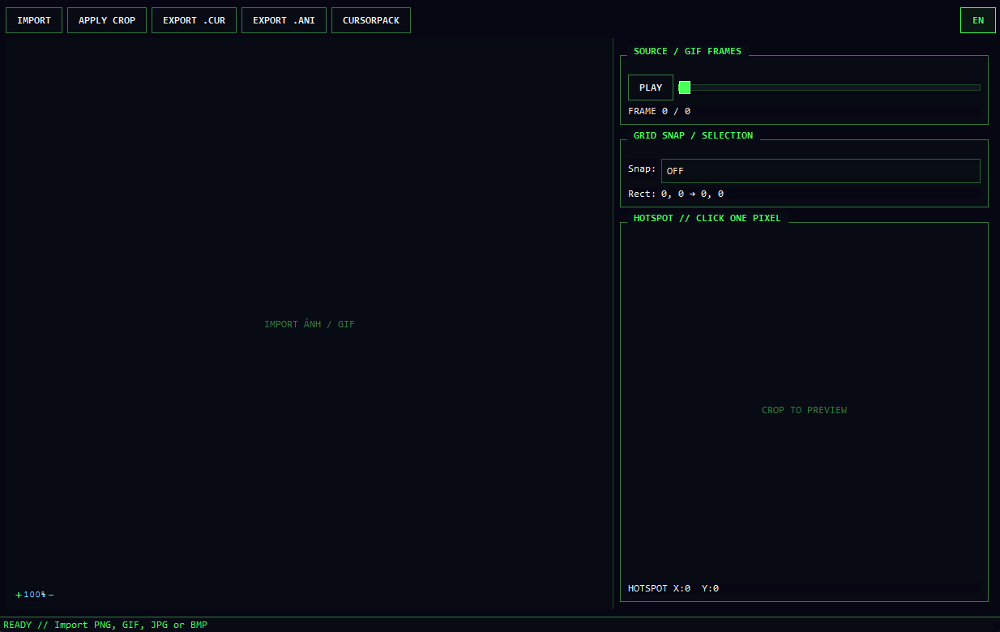

# Benj Cursor Maker — Neon Pixel Edition

A Windows desktop app to crop images/GIFs and create `.cur` / `.ani` mouse cursors plus an installable cursor pack (with `install.bat`). PyQt6 retro 16-bit UI — all zoom/scale operations use **Nearest-Neighbor** to keep pixel art crisp. The interface supports **Vietnamese / English** (EN/VN button, top-right corner).



## Features

- Import PNG, GIF, JPG/JPEG, BMP — animated GIFs with Play/Pause and a frame slider (per-frame durations preserved).
- Drag directly on the image to select a crop region; Grid Snap OFF/16/32/48 px.
- Click a single pixel to set the **hotspot** (synchronized zoom + pan on both canvases).
- Export `.cur` (static) and `.ani` (standard RIFF/ACON, per-frame timing).
- **Cursorpack Builder**: assign `.cur`/`.ani` files — or the current editor crop + hotspot directly — to 15 Windows states (Normal, Help, Text, Busy…). **Apply** saves temporarily so you can keep assigning; **Save** exports a pack folder with `install.inf` + `install.bat` that installs and activates the scheme.
- **Hover preview** in the Builder: moving the mouse over a state shows the assigned cursor (animation included); unassigned states show nothing.
- No file export needed before assigning — the current crop + hotspot go straight into a Windows state.

## Requirements

- Windows 10/11 64-bit.
- Python **3.11+** (only needed for the first run).

## Run (portable)

Double-click **`run.bat`** — no installation needed:

- First run: automatically creates the `.venv` environment and installs dependencies, then opens the app.
- Later runs: opens the app directly, **no cmd window** appears.

Or run manually:

```bash
python -m venv .venv
.venv\Scripts\activate
python -m pip install -r requirements.txt
python main.py
```

## Usage

1. Click **IMPORT** and pick an image or GIF.
2. For GIFs: **PLAY/PAUSE** or drag the frame slider.
3. Pick a Grid Snap, then drag on the image to select the region; click **APPLY CROP** — the crop applies to every frame.
4. In the HOTSPOT box, click the pixel that should be the cursor's touch point (applied to all frames).
5. **EXPORT .CUR** for the current frame, or **EXPORT .ANI** for the whole animation.
6. **CURSORPACK**: select a state → assign the current cursor directly (**ASSIGN CURRENT CURSOR**) or from a file (**ASSIGN .CUR / .ANI**). **Apply** saves and closes so you can edit the image and keep assigning; **Save** exports the pack.

## Installing a cursor pack on Windows

The app exports a plain **folder named after the scheme** (no archive):

1. After Save, pick a parent folder — the app creates `<Scheme Name>/` containing `install.bat`, `install.inf`, `README.txt` and the cursors.
2. Open that folder and double-click `install.bat` → **Yes** when Windows asks for Administrator rights.
3. The script copies the cursors into `%WINDIR%\Cursors\<Scheme Name>`, registers and activates the scheme, then refreshes Windows. No cmd window appears.

> Windows may warn because the installer is unsigned. The script only touches the current user's cursor scheme.

## Tests

```bash
.venv\Scripts\python.exe -m pytest -q
```

## Project structure

```
main.py              # entry point
ui.py                # all widgets/UI + interaction flow
image_processor.py   # frame loading, crop, grid snap, Nearest-Neighbor resize
exporter.py          # CUR/ANI/install.inf/install.bat writers, ANI parser, cursor pack export
i18n.py              # Vietnamese / English translation table
tooltip_style.py     # disables system tooltip animation
tests/               # binary format, pixel processing and UI smoke tests
run.bat              # portable launcher (auto venv, hidden console)
```

## Format notes

- Windows cursors are limited to 256×256 px — larger crops are downscaled with Nearest-Neighbor.
- `.cur` uses 32-bit BGRA DIB + AND mask, with hotspot.
- `.ani` packs CUR frames in RIFF/ACON; durations are converted to 1/60 s ticks per the Windows spec.
